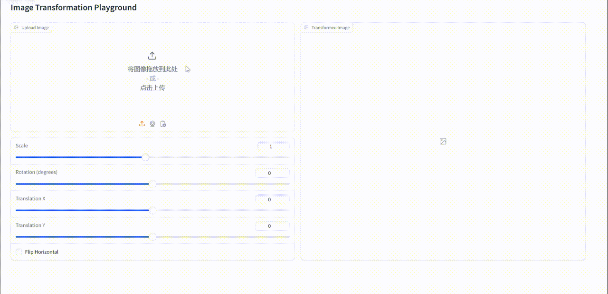

# 第一次作业：[Implementation of Image Geometric Transformation]

This repository is Yudong Guo's implementation of Assignment_01 of DIP.

## Requirements

To install requirements:
```bash
pip install -r requirements.txt
```

## Running
To run basic transformation, run:
```bash
python run_global_transform.py
```
To run point guided transformation, run:
```bash
python run_point_transform.py
```
## Results
This section includes results from both transformation methods.

### Basic Transformation

Below is a demo video of the Basic Transformation results.


### Point Guided Deformation

Below is a demo video of the Point Guided Deformation process.


## Acknowledgement
Thanks for the algorithms proposed by Image Deformation Using Moving Least Squares.
