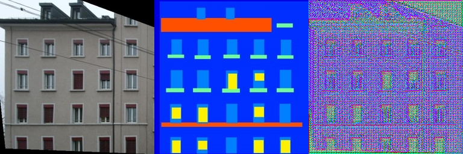
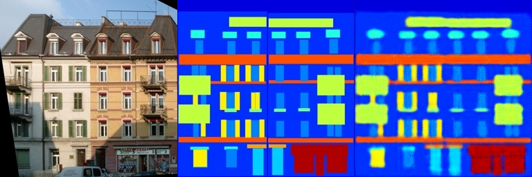
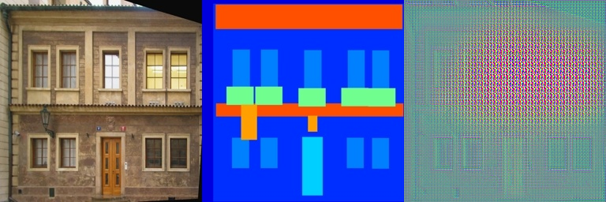

# Assignment 2 - DIP with PyTorch

## Implementation of Poisson Image Editing and Pix2Pix

This repository is my implementation of Assignment_02 of DIP.

<!-- 
📌 【你需要做的】：在下面这行替换成你自己的效果预览图（teaser图）。
   运行代码后截一张最终效果图（比如泊松融合的结果），放到 pics/ 文件夹下，然后修改路径。
   如果暂时没有图，可以先不管这行。
-->


## Requirements

To install requirements:

```setup
conda create -n dip python=3.10 -y
conda activate dip

# GPU 版本（推荐，需要 NVIDIA 显卡 + CUDA）
pip install torch torchvision --index-url https://download.pytorch.org/whl/cu118

# CPU 版本（没有显卡时使用）
# pip install torch torchvision

pip install gradio pillow numpy opencv-python
```

## Running

To run Poisson Image Blending:

```poisson
cd Assignments/02_DIPwithPyTorch
python run_blending_gradio.py
```

To run Pix2Pix training:

```pix2pix
cd Assignments/02_DIPwithPyTorch/Pix2Pix
bash download_facades_dataset.sh
python train.py
```

## Results

### 1. Poisson Image Editing (泊松图像编辑)

#### 实现说明

在 `run_blending_gradio.py` 中完成了两个核心函数：

1. **`create_mask_from_points()`** — 将用户绘制的多边形顶点转换为二值蒙版（mask），使用 `PIL.ImageDraw.polygon()` 实现多边形内部填充。

2. **`cal_laplacian_loss()`** — 计算拉普拉斯损失函数。定义 3×3 拉普拉斯卷积核，分别对前景图和融合图进行卷积运算提取梯度信息，在蒙版区域内计算梯度差异的平方和作为损失值，通过 5000 步 Adam 优化器迭代使融合图梯度逼近前景图梯度。

#### 结果展示

<!-- 
📌 【你需要做的】：
   1. 运行 python run_blending_gradio.py
   2. 浏览器打开 http://127.0.0.1:7860
   3. 上传前景图和背景图（可用 data_poisson/ 里的图片）
   4. 画多边形 → Close Polygon → 调整位置 → Blend Images
   5. 对融合结果截图，保存到 pics/ 文件夹（例如 pics/poisson_result1.png）
   6. 把下面的图片路径替换成你自己的截图

   建议至少展示 2-3 组不同的融合结果。
-->

**融合结果 1：**
<!-- 替换下面路径为你的截图 -->


**融合结果 2：**
<!-- 替换下面路径为你的截图 -->


**融合结果 3：**
<!-- 替换下面路径为你的截图 -->


---

### 2. Pix2Pix with FCN (Pix2Pix 图像翻译)

#### 实现说明

在 `Pix2Pix/FCN_network.py` 中实现了完整的 U-Net 风格全卷积网络：

**编码器（Encoder）**：5 层卷积，每层使用 4×4 卷积核、stride=2 逐步下采样，通道数 3→8→16→32→64→128，每层后接 BatchNorm + ReLU。

**解码器（Decoder）**：5 层转置卷积，逐步上采样恢复原始分辨率。使用跳跃连接（Skip Connection）将编码器对应层的特征图在通道维度拼接到解码器输入，保留更多空间细节。最后一层使用 Tanh 激活函数，使输出值域为 [-1, 1]，与训练数据归一化范围一致。

**训练配置**：L1 Loss + Adam 优化器（lr=0.001, betas=(0.5, 0.999)），StepLR 学习率衰减，共训练 300 个 epoch。

#### 结果展示

<!-- 
📌 【你需要做的】：
   1. 运行以下命令开始训练：
      cd Assignments/02_DIPwithPyTorch/Pix2Pix
      bash download_facades_dataset.sh
      python train.py
   2. 训练完成后，在 train_results/ 和 val_results/ 文件夹下会有每 5 个 epoch 保存的结果图
      每张图是 [输入 | 目标 | 输出] 三图横向拼接
   3. 挑选几个有代表性的 epoch 的结果图（如 epoch_0、epoch_50、epoch_100、epoch_295 等）
      复制到 pics/ 文件夹，然后替换下面的图片路径

   建议展示训练早期、中期、后期的对比，体现模型逐步学习的过程。
-->

**训练集结果（早期 epoch）：**
<!-- 替换路径为 train_results/epoch_0/ 中的某张图 -->


**训练集结果（后期 epoch）：**
<!-- 替换路径为 train_results/epoch_295/ 中的某张图 -->


**验证集结果（早期 epoch）：**
<!-- 替换路径为 val_results/epoch_0/ 中的某张图 -->


**验证集结果（后期 epoch）：**
<!-- 替换路径为 val_results/epoch_295/ 中的某张图 -->


<!-- 
📌 【可选加分】：
   如果你有时间，可以尝试使用更大的数据集（如 cityscapes、maps 等）
   从 https://github.com/phillipi/pix2pix#datasets 下载
   展示在更大数据集上的结果可以获得更好的成绩。
-->

## Acknowledgement

>📋 Thanks for the algorithms proposed by:
> - [Poisson Image Editing (Pérez et al., 2003)](https://www.cs.jhu.edu/~misha/Fall07/Papers/Perez03.pdf)
> - [Image-to-Image Translation with Conditional Adversarial Nets (Isola et al., 2017)](https://phillipi.github.io/pix2pix/)
> - [Fully Convolutional Networks for Semantic Segmentation (Long et al., 2015)](https://arxiv.org/abs/1411.4038)
