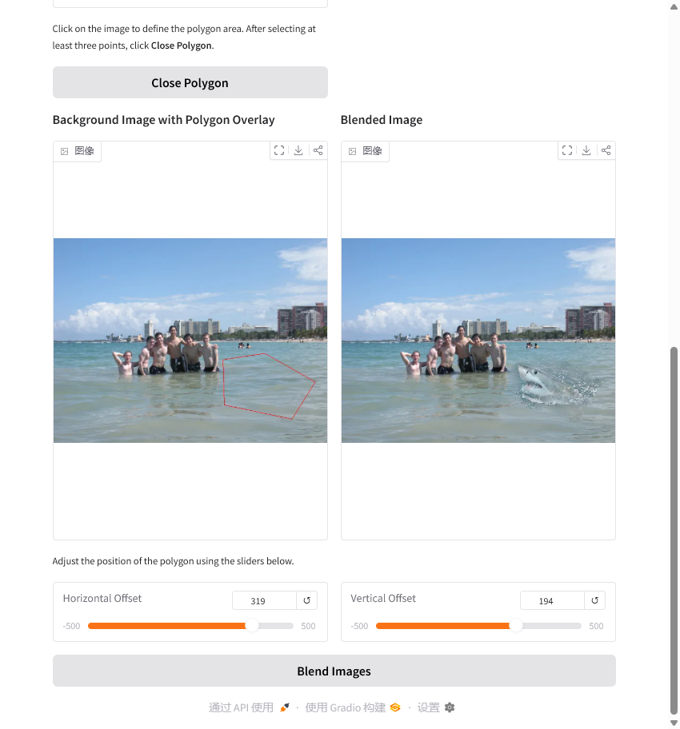
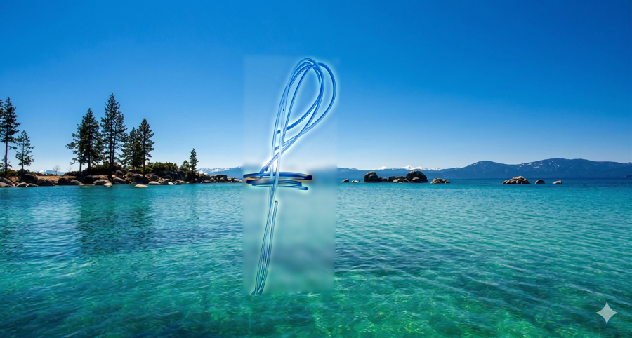
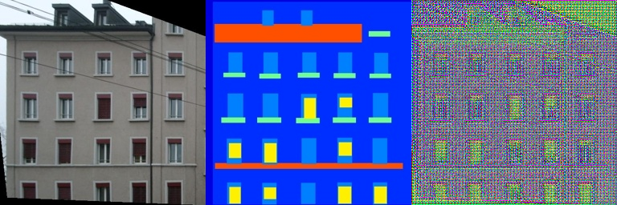
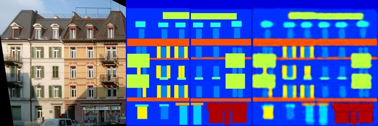

# Assignment 2 - DIP with PyTorch

## Poisson Image Editing 与 Pix2Pix 实现

这是 DIP 课程 Assignment 2 的作业提交目录，包含：

1. 使用 PyTorch 实现泊松图像融合；
2. 使用全卷积网络实现 Pix2Pix 图像翻译实验。


## 环境配置

```bash
conda create -n dip python=3.10 -y
conda activate dip

# GPU 版本（推荐，需要 NVIDIA 显卡 + CUDA）
pip install torch torchvision --index-url https://download.pytorch.org/whl/cu118

# CPU 版本（没有显卡时使用）
# pip install torch torchvision

pip install -r requirements.txt
```

## 运行方式

运行泊松图像融合：

```bash
cd homework2
python run_blending_gradio.py
```

运行后在浏览器打开 Gradio 地址，上传 `data_poisson/` 中的前景图和背景图，绘制多边形后点击 **Blend Images**。

运行 Pix2Pix 训练：

```bash
cd homework2
bash download_facades_dataset.sh facades
python train.py --epochs 300
```

如果使用已有的 edges2shoes 列表，可运行：

```bash
python train.py --train-list train_list2.txt --val-list val_list2.txt --epochs 300
```

## 结果

### 1. Poisson Image Editing（泊松图像编辑）

#### 实现说明

在 `run_blending_gradio.py` 中完成了两个核心函数：

1. **`create_mask_from_points()`**：将用户绘制的多边形顶点转换为二值蒙版。多边形内部为 255，外部为 0。

2. **`cal_laplacian_loss()`**：计算拉普拉斯损失。使用 3x3 拉普拉斯卷积核分别提取前景图和融合图的梯度信息，并在 mask 区域内最小化二者差异。

拉普拉斯核为：

```text
[0,  1, 0]
[1, -4, 1]
[0,  1, 0]
```

优化时固定背景图中非 mask 区域，仅更新目标区域像素，使融合区域保留前景图的梯度结构，同时自然过渡到背景图。

#### 结果展示

**融合结果 1：water 样例**


**融合结果 2：equation 样例（三角形）**



**融合结果 3：equation 样例（右侧曲线）**



---

### 2. Pix2Pix with FCN（Pix2Pix 图像翻译）

#### 实现说明

在 `FCN_network.py` 中实现了完整的 U-Net 风格全卷积网络：

**编码器（Encoder）**：5 层卷积，每层使用 4x4 卷积核、stride=2 逐步下采样，通道数为 3 -> 64 -> 128 -> 256 -> 512 -> 1024，每层后接 BatchNorm + ReLU。

**解码器（Decoder）**：5 层转置卷积，逐步上采样恢复原始分辨率。使用跳跃连接（Skip Connection）将编码器对应层的特征图在通道维度拼接到解码器输入，保留更多空间细节。最后一层使用 Tanh 激活函数，使输出值域为 [-1, 1]，与训练数据归一化范围一致。

**训练配置**：L1 Loss + Adam 优化器（lr=0.001, betas=(0.5, 0.999)），StepLR 学习率衰减，共训练 300 个 epoch。

#### Loss 曲线


#### 结果展示

每张结果图从左到右分别是：

```text
[ 输入图像 | 目标图像 | 模型输出 ]
```

**训练集结果（早期 epoch）：**



**训练集结果（后期 epoch）：**



**验证集结果（早期 epoch）：**


**验证集结果（后期 epoch）：**


## 文件说明

```text
homework2/
├── run_blending_gradio.py       # 泊松图像编辑 Gradio 程序
├── FCN_network.py               # Pix2Pix 全卷积网络
├── train.py                     # Pix2Pix 训练脚本
├── facades_dataset.py           # 数据集读取脚本
├── download_facades_dataset.sh  # 数据集下载与列表生成脚本
├── data_poisson/                # 泊松融合示例输入图
├── pics/                        # README 展示图
├── train_results/               # Pix2Pix 训练集结果
├── val_results/                 # Pix2Pix 验证集结果
├── train_2results/              # edges2shoes 训练集结果
└── val_2results/                # edges2shoes 验证集结果
```

## Acknowledgement

> 参考论文：
> - [Poisson Image Editing (Perez et al., 2003)](https://www.cs.jhu.edu/~misha/Fall07/Papers/Perez03.pdf)
> - [Image-to-Image Translation with Conditional Adversarial Nets (Isola et al., 2017)](https://phillipi.github.io/pix2pix/)
> - [Fully Convolutional Networks for Semantic Segmentation (Long et al., 2015)](https://arxiv.org/abs/1411.4038)
