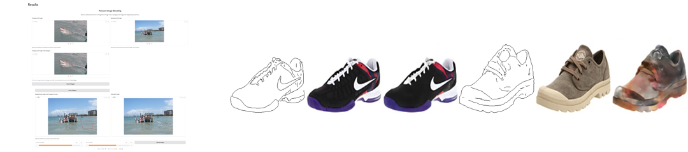
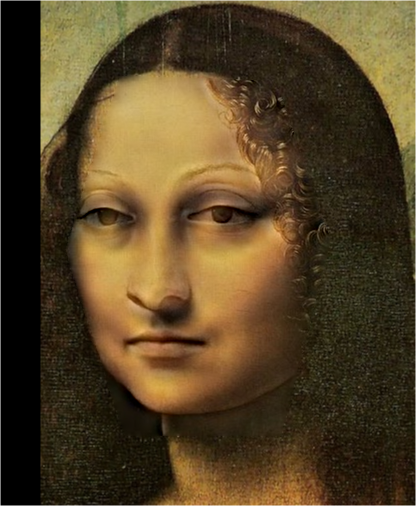
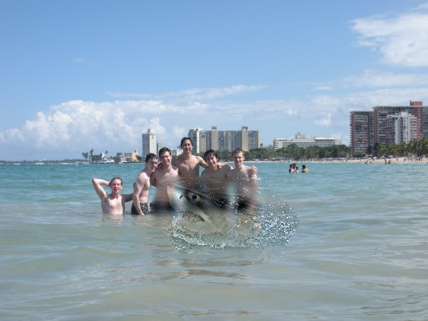
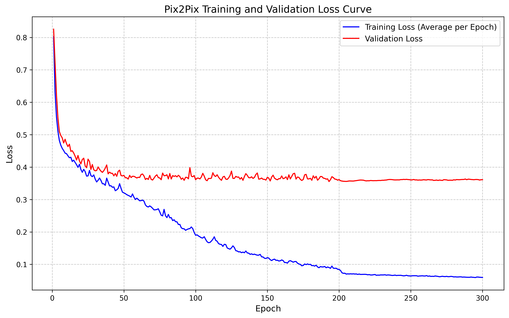
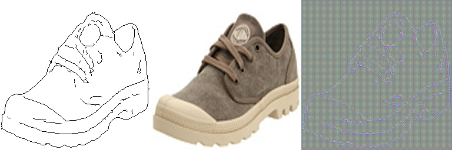
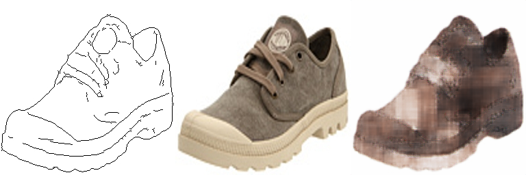
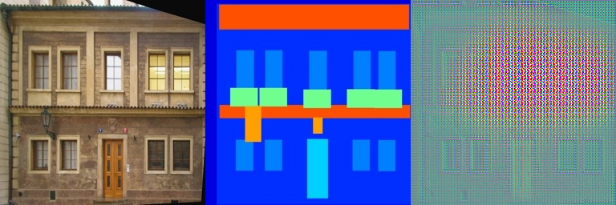
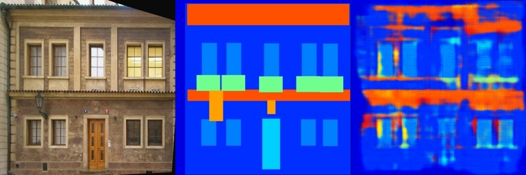

# Assignment 2 - DIP with PyTorch

> Digital Image Processing (DIP) | Poisson Image Editing and Pix2Pix



## Requirements Covered

This submission implements the two required parts of Assignment 2:

1. **Poisson Image Editing** in `run_blending_gradio.py`
   - `create_mask_from_points()` converts clicked polygon vertices into a binary mask.
   - `cal_laplacian_loss()` computes the masked Laplacian loss with PyTorch convolution.
2. **Pix2Pix with a Fully Convolutional Network** in `FCN_network.py`
   - A U-Net style encoder-decoder is implemented with skip connections.
   - `train.py` trains with L1 loss and saves train/validation visualizations.

## Environment

```bash
conda create -n dip python=3.10 -y
conda activate dip
pip install -r requirements.txt
```

For CUDA machines, install the matching PyTorch build from the official PyTorch selector before installing the remaining packages.

## Part 1: Poisson Image Editing

### Implementation

The polygon mask is rasterized with `PIL.ImageDraw.polygon()` into a single-channel image where the selected region is 255 and the background is 0.

The Poisson objective uses the standard 4-neighbor Laplacian kernel:

```text
[0,  1, 0]
[1, -4, 1]
[0,  1, 0]
```

For each RGB channel, the script computes the Laplacian response of the foreground and current blended image, then minimizes the masked squared difference with Adam. The Gradio UI keeps the background fixed outside the target mask.

### Run

```bash
python run_blending_gradio.py
```

Open the local Gradio URL, upload one foreground and one background image from `data_poisson/`, draw a polygon on the foreground, close it, adjust the target offset, and click **Blend Images**.

### Results

The examples below were generated by calling the same PyTorch blending function with fixed polygons for reproducibility. The interactive UI uses 5000 optimization steps by default; these preview images used 800 steps.

| Example | Initial Loss | Final Logged Loss |
|---|---:|---:|
| Mona Lisa face blending | 836.15 | 0.7434 |
| Water/shark blending | 4673.10 | 1.1776 |

**Mona Lisa blending**



**Water blending**



## Part 2: Pix2Pix with FCN

### Implementation

`FullyConvNetwork` is a five-level U-Net style fully convolutional model:

| Stage | Channels | Resolution |
|---|---:|---:|
| Input | 3 | 256 x 256 |
| Encoder | 64, 128, 256, 512, 1024 | down to 8 x 8 |
| Decoder | 512, 256, 128, 64, 3 | up to 256 x 256 |

Skip connections concatenate decoder features with the corresponding encoder features. The output uses `Tanh`, matching the dataset normalization to `[-1, 1]`.

`train.py` supports portable paths and command-line options:

```bash
bash download_facades_dataset.sh facades
python train.py --epochs 300 --batch-size 8 --val-batch-size 8
```

The larger reported run used the `edges2shoes` lists already included in this directory:

```bash
python train.py --train-list train_list2.txt --val-list val_list2.txt --epochs 300
```

### Training Results

The stored run trained for 300 epochs. The final log entries were:

```text
Epoch [300/300], Step [1/2], Loss: 0.0596
Epoch [300/300], Step [2/2], Loss: 0.0593
Epoch [300/300], Validation Loss: 0.3611
```



Each result image is `[input | target | output]`.

**Edges2Shoes validation, epoch 0**



**Edges2Shoes validation, epoch 295**



**Facades validation, epoch 0**



**Facades validation, epoch 295**



## File Layout

```text
homework2/
├── run_blending_gradio.py       # Poisson image editing Gradio app
├── FCN_network.py               # U-Net style FCN model
├── train.py                     # Pix2Pix training script
├── facades_dataset.py           # Paired image dataset loader
├── download_facades_dataset.sh  # Pix2Pix dataset downloader/list generator
├── requirements.txt
├── data_poisson/                # Poisson sample images
├── pics/                        # Compact report images
├── train_results/, val_results/ # Facades snapshots
└── train_2results/, val_2results/ # Edges2Shoes snapshots
```

Model checkpoints and downloaded datasets are intentionally ignored by `.gitignore`; the submitted directory keeps source code, input examples, list files, report images, and representative experiment outputs.

## Acknowledgement

- [Poisson Image Editing, Perez et al. 2003](https://www.cs.jhu.edu/~misha/Fall07/Papers/Perez03.pdf)
- [Image-to-Image Translation with Conditional Adversarial Nets, Isola et al. 2017](https://phillipi.github.io/pix2pix/)
- [Fully Convolutional Networks for Semantic Segmentation, Long et al. 2015](https://arxiv.org/abs/1411.4038)
