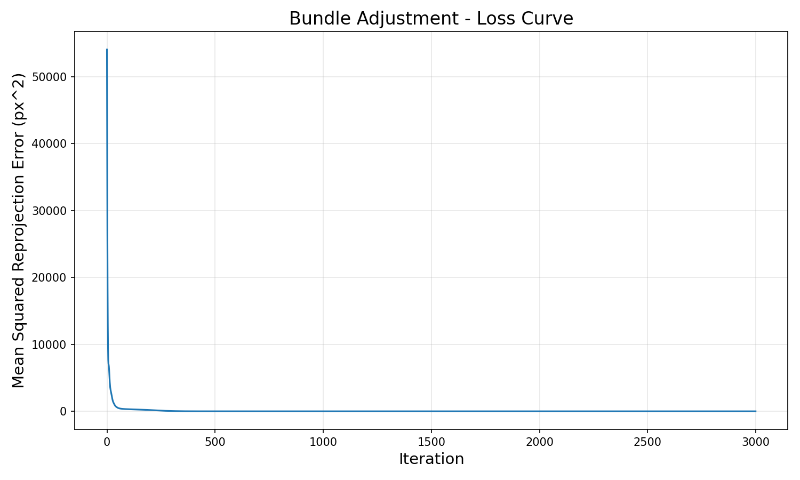
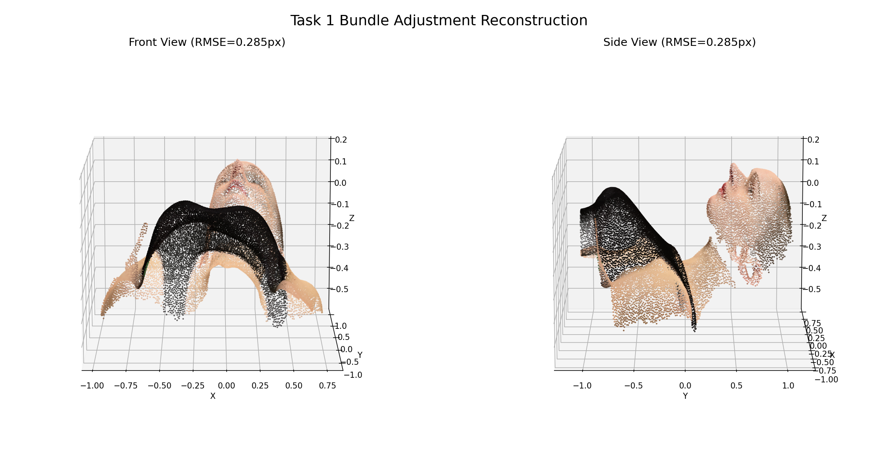
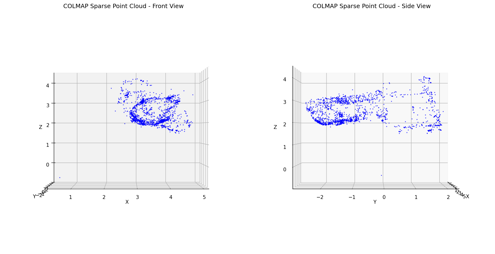
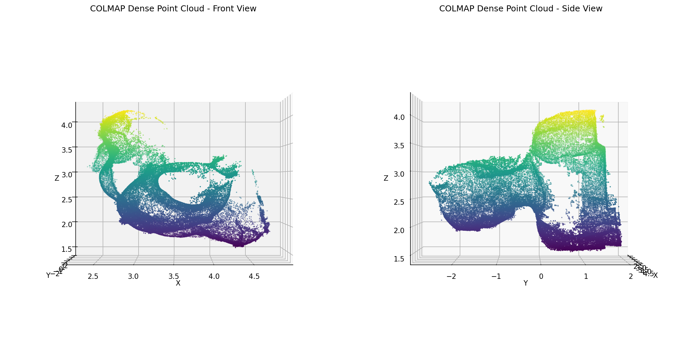

# Assignment 3 - Bundle Adjustment

> **Digital Image Processing (DIP)** | **Due**: 2026.04.30

---

## Task 1: Implement Bundle Adjustment with PyTorch

### 方法概述

使用 PyTorch 实现 Bundle Adjustment，从 50 个视角的 2D 观测数据中恢复：
1. **焦距 f**（所有相机共享）
2. **相机外参**：旋转 R（Euler 角参数化）和平移 T（50 组）
3. **3D 点坐标**（20000 个点）

### 实现细节

**投影函数**：
```
相机变换: [Xc, Yc, Zc] = R @ [X, Y, Z]^T + T
投影公式: u = -f * Xc / Zc + cx, v = f * Yc / Zc + cy
cx = 512, cy = 512 (图像宽高均为 1024)
```

**旋转参数化**：使用 XYZ 顺序的 Euler 角，避免直接优化 3×3 旋转矩阵（减少参数且保证正交性）。

**初始化**：
- 焦距：根据 FoV=60° 估算，`f = H / (2 * tan(30°)) ≈ 886`
- 旋转：初始化为单位矩阵（Euler 角为零）
- 平移：初始化为 `[0, 0, -2.5]`（相机在物体前方 2.5 单位）
- 3D 点：在原点附近随机初始化（标准差 0.1）

**优化策略**：
- 损失函数：可见点的 MSE 重投影误差 + 正则化（中心约束 + 相机朝向约束 + 位姿衰减）
- 焦距参数化：`f = exp(log_f)` 保证焦距恒为正
- 优化器：Adam（不同参数组使用不同学习率）
  - 焦距：lr=0.01
  - Euler 角：lr=0.01
  - 平移：lr=0.01
  - 3D 点：lr=0.1
- 学习率调度：CosineAnnealingLR（T_max=3000）
- 迭代次数：3000

**运行方式**：

```bash
pip install -r requirements.txt
python bundle_adjustment.py
```

脚本默认从当前目录下的 `data/` 读取 `points2d.npz` 和 `points3d_colors.npy`，并输出 `loss_curve.png` 与 `reconstruction.obj`。

### 结果

**优化结果**：

| 指标 | 值 |
|------|------|
| 最终 RMSE（可见点） | **0.2848 像素** |
| 最终 MSE（可见点） | 0.0811 |
| 最大重投影误差（可见点） | 1.7788 像素 |
| 焦距 f | 854.04 |

**Loss 曲线**：



**重建 3D 点云**：



**相机参数（部分）**：

| Camera | Rotation (rx, ry, rz) | Translation (x, y, z) |
|--------|----------------------|----------------------|
| 0 | (-25.10°, 69.74°, -16.83°) | (0.425, 0.017, -2.773) |
| 12 | (-7.76°, 36.96°, 4.77°) | (0.265, 0.026, -2.564) |
| 25 | (-4.37°, -0.44°, 8.52°) | (-0.008, -0.025, -2.478) |
| 37 | (-1.27°, -35.10°, 5.22°) | (-0.260, -0.072, -2.569) |
| 49 | (14.18°, -68.31°, -14.27°) | (-0.423, -0.064, -2.784) |

重建的点云包含 20000 个带颜色（RGB）的 3D 点，已保存为 OBJ 格式（`reconstruction.obj`）。

---

## Task 2: 3D Reconstruction with COLMAP

使用 COLMAP 对 50 张渲染图像进行完整的三维重建。

### 重建流程

运行环境：Windows 11，COLMAP 4.1.0.dev0 (CUDA, commit 5b76f53)，本地可执行文件位于 `F:\迅雷下载\colmap-x64-windows-cuda\bin\colmap.exe`。

**运行方式**：

```powershell
cd Assignments/03_BundleAdjustment
powershell -NoProfile -ExecutionPolicy Bypass -File .\run_colmap_windows.ps1
```

脚本会使用 `data/images/` 中的 50 张图像运行 COLMAP；如果已有 `data/colmap/dense/fused.ply`，默认只输出稀疏模型分析。如需从头覆盖已有结果，可追加 `-Force` 重新生成 `data/colmap/`。Linux/macOS 环境可使用作业提供的 `run_colmap.sh`。

**步骤**：
1. **特征提取** (SIFT GPU) — 每张图像提取 244~535 个 SIFT 特征
2. **特征匹配** (Exhaustive Matching) — 50 张图像共 1225 对候选匹配，其中 826 对有原始匹配，762 对通过 two-view geometry 验证
3. **稀疏重建** (Mapper) — 注册全部 50 张图像，生成 1701 个稀疏 3D 点
4. **图像去畸变**
5. **稠密重建** (Patch Match Stereo) — 50 个视角，GPU 加速
6. **立体融合** — 最终融合为稠密点云

### 结果

**稀疏点云**：
- 注册图像数：50/50
- 重建 3D 点：1701 个
- 相机参数：1 组内参，50 组外参
- 相机模型：PINHOLE, 1024×1024, fx=890.57, fy=877.61, cx=512, cy=512
- Observations：13612，平均 track length：8.00
- 平均重投影误差：0.6663 px

**稠密点云**：
- 融合点数：111,097 个
- 输出文件：`data/colmap/dense/fused.ply`
- PLY 顶点包含法向量和 RGB 颜色字段

**稀疏点云可视化**：



**稠密点云可视化**：



---

## 对比分析

| 方法 | 3D 点数 | 点密度 | 优点 | 缺点 |
|------|---------|--------|------|------|
| **Task 1 Bundle Adjustment (PyTorch)** | 20,000 | 已知所有点 | 精度高，可用颜色 | 需要已知对应关系 |
| **COLMAP Sparse** | 1,701 | 稀疏 | 自动特征匹配 | 点较少 |
| **COLMAP Dense** | 111,097 | 稠密 | 点云完整，包含 RGB 颜色 | 计算量大，对纹理和匹配质量依赖较强 |

两种方法互补：Task 1 提供了精确的 20000 点重建和颜色信息，而 COLMAP 提供了完整的自动 3D 重建流程，包括稠密点云。
