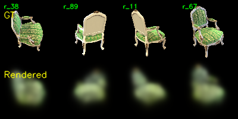
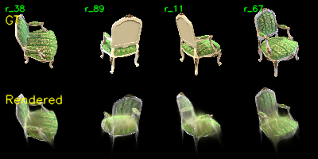
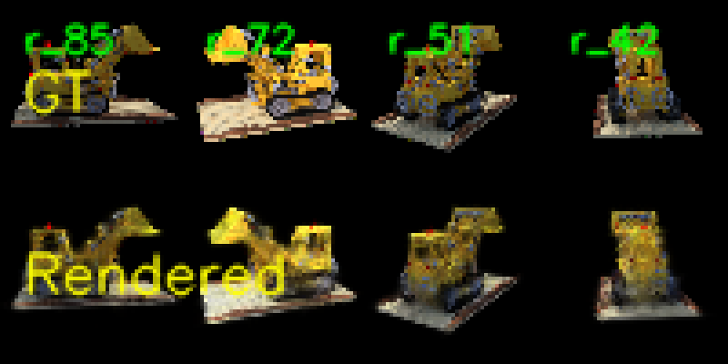
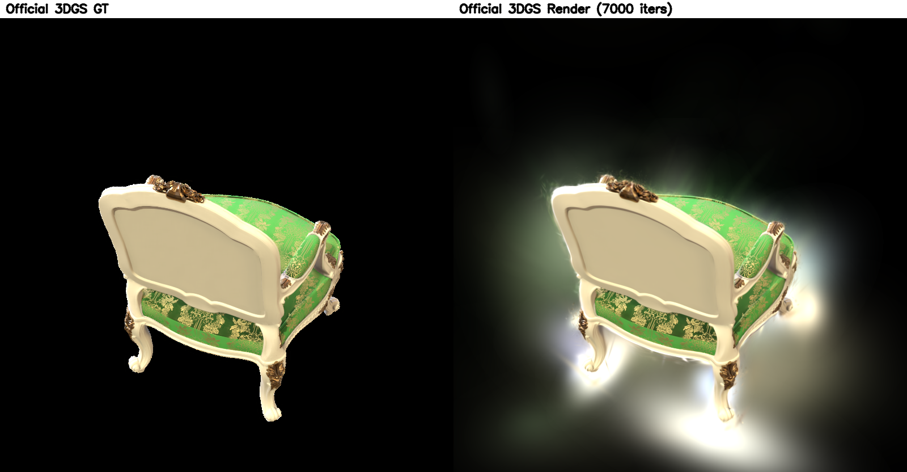
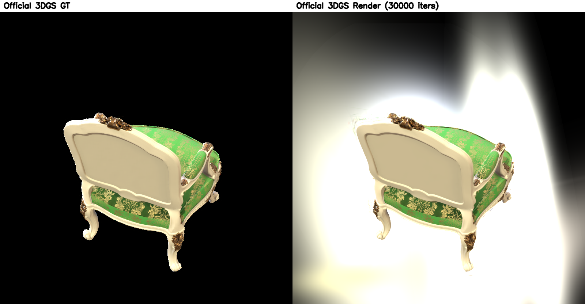

# Assignment 4 - Simplified 3D Gaussian Splatting

## 简介

本目录完成 DIP 课程 Homework4：使用 COLMAP 从多视角图像恢复相机和稀疏点云，并用纯 PyTorch 实现一个简化版 3D Gaussian Splatting renderer。主实验使用课程提供的 `chair`，额外补充 `lego` 数据集；最后加入 Task 3 中与官方 3DGS 实现的对比。

参考作业目录：[YudongGuo/DIP-Teaching - Assignments/04_3DGS](https://github.com/YudongGuo/DIP-Teaching/tree/main/Assignments/04_3DGS)

## 文件说明

```text
homework4/
├── gaussian_model.py              # 3D Gaussian 参数、scale/rotation/covariance
├── gaussian_renderer.py           # 3D 到 2D 投影、Gaussian rasterization、alpha compositing
├── data_utils.py                  # COLMAP 文本模型与图像数据读取
├── mvs_with_colmap.py             # COLMAP SfM 流程
├── debug_mvs_by_projecting_pts.py # 点云重投影可视化
├── train.py                       # 简化 3DGS 训练脚本
├── render_3dgs_mv.py              # 可选的训练后水平环绕视角渲染脚本
├── smoke_test_3dgs.py             # 核心张量前向 smoke test
├── pics/                          # README 展示图
└── logs/                          # 运行摘要与官方对比记录
```

## 环境与运行

本次实验使用独立 Python 环境运行。关键依赖包括 `COLMAP 3.13.0`、`PyTorch 2.11.0+cu128`、`OpenCV 4.13.0`、`natsort`、`tqdm`。注意 COLMAP 3.13 的 GPU 参数名是 `FeatureExtraction.use_gpu` 和 `FeatureMatching.use_gpu`，因此我更新了原脚本中的旧参数名。

```bash
conda create -n dip_hw4_3dgs python=3.10 colmap opencv natsort tqdm imageio imageio-ffmpeg ffmpeg numpy scipy -c conda-forge
conda activate dip_hw4_3dgs
python -m pip install torch torchvision --index-url https://download.pytorch.org/whl/cu128
```

主数据集 `chair` 的运行顺序：

```bash
python mvs_with_colmap.py --data_dir data/chair
python debug_mvs_by_projecting_pts.py --data_dir data/chair
python smoke_test_3dgs.py
python train.py --colmap_dir data/chair \
  --checkpoint_dir outputs/chair_checkpoints \
  --num_epochs 200 \
  --debug_every 10 \
  --debug_samples 4 \
  --device cuda
```

额外数据集 `lego` 使用同样流程：

```bash
python mvs_with_colmap.py --data_dir data/lego
python debug_mvs_by_projecting_pts.py --data_dir data/lego
python train.py --colmap_dir data/lego \
  --checkpoint_dir outputs/lego_checkpoints \
  --num_epochs 200 \
  --debug_every 10 \
  --debug_samples 4 \
  --device cuda
```

## 实现说明

### 1. COLMAP SfM

`mvs_with_colmap.py` 依次运行 feature extraction、exhaustive matching、mapper 和 model converter，输出 `sparse/0_text` 下的 `cameras.txt`、`images.txt`、`points3D.txt`。本次 `chair` 数据集共注册 100 张图像，生成 13,458 个稀疏 3D 点；`lego` 数据集共注册 100 张图像，生成 5,704 个稀疏 3D 点。

重投影调试图如下，左侧是带重投影点的原图，右侧是稀疏点云在该视角下的投影效果：


### 2. 3D Gaussian Model

`gaussian_model.py` 中实现了：

- 位置 `positions`：由 COLMAP 稀疏点初始化；
- 颜色 `colors`：由 COLMAP 点云 RGB 初始化，并用 logit 空间优化；
- 透明度 `opacities`：用 logit 空间优化；
- scale：用纯 PyTorch 的 `torch.cdist + topk` 估计近邻距离，不再依赖 PyTorch3D；
- covariance：由 quaternion 得到旋转矩阵 `R`，再计算 `R @ diag(scale^2) @ R.T`。

### 3. Gaussian Renderer

`gaussian_renderer.py` 中实现了：

- 世界坐标到相机坐标的变换；
- pinhole camera 投影；
- perspective projection Jacobian；
- 3D covariance 到 2D covariance 的投影；
- 2D Gaussian value；
- 按深度排序后的 front-to-back alpha compositing。

为了保持纯 PyTorch 版本可运行，我没有使用官方 3DGS 的 tile-based rasterizer、adaptive densification 或 CUDA fused kernel。因此本实现更适合作为教学版 baseline，渲染速度和质量都不能与官方实现直接等价。

## 实验结果

每张 debug 图上排是 GT 训练视角，下排是当前模型渲染结果。

**Chair, Epoch 0：**



**Chair, Epoch 100：**



**Chair, Epoch 190：**


`chair` 训练 200 个 epoch 后，日志中的最后 loss 约为 `0.0408`。可以看到模型从初始模糊 Gaussian blob 逐渐学到了椅子的主体结构和绿色纹理，但由于没有 densification 和高效 rasterization，边缘仍有明显拖影，细节也弱于官方 3DGS。

**Lego, Epoch 190：**



`lego` 训练 200 个 epoch 后，日志中的最后 loss 约为 `0.0389`。这个结果说明同一套简化 PyTorch renderer 可以迁移到第二个多视角物体数据集，但固定稀疏点初始化和缺少 densification 仍限制了几何边界和纹理细节。

## Task 3：与官方 3DGS 对比

为了更清楚地说明简化实现和官方实现的差异，我额外运行了官方 3DGS 代码在 `chair` 数据集上的训练与渲染。官方实现需要编译 CUDA rasterizer 相关扩展，核心命令如下：

```bash
python -m pip install --no-build-isolation \
  submodules/diff-gaussian-rasterization \
  submodules/simple-knn \
  submodules/fused-ssim

python train.py -s data/chair -m outputs/chair_official_30000 \
  --iterations 30000

python render.py -s data/chair -m outputs/chair_official_30000 \
  --iteration 30000 --skip_test
```

官方实现的主要优势是使用 tile-based CUDA rasterizer，并包含 densification、pruning、opacity reset 等训练策略；而本作业实现是固定 COLMAP 稀疏点初始化的纯 PyTorch 版本，代码更直接，但速度和质量都有明显差距。

| 方法 | 训练设置 | 结果观察 | 运行记录 |
| --- | --- | --- | --- |
| 本作业简化版 | `chair` 200 epochs | 主体形状可见，但边缘拖影和细节缺失明显 | final loss `0.0408`；5-epoch probe 约 `72.09s`，约 `6.9` views/s，GPU memory 约 `3.35 GiB` |
| 官方 3DGS | `chair` 30,000 iterations | 椅子主体更锐利，但当前默认设置下背景区域有较明显 floaters / 过亮伪影 | final training loss 约 `0.0097`；`394.85s`，约 `76` it/s，peak CPU RSS `4.26 GB`，GPU memory probe 约 `2.1 GiB` |

官方 7,000 iterations 的结果整体更稳定，物体已经比简化版更清晰：



官方 30,000 iterations 的物体细节更锐，但背景伪影更明显，说明官方实现虽然更强，但仍需要根据数据和背景情况调节训练策略：



这个对比验证了 Task 3 的关键结论：官方 3DGS 的优化 rasterizer 和动态 Gaussian 管理能显著提升收敛速度与主体质量；本作业的 simplified 版本更适合理解 3DGS 的数学流程，包括 covariance 投影、2D Gaussian splatting 和 alpha compositing。

## 验证

已完成的验证：

```text
Chair COLMAP registered images: 100
Chair COLMAP sparse points: 13458
Chair projection debug images: 100
Chair simplified training epochs: 200
Chair simplified final logged loss: 0.0408

Lego COLMAP registered images: 100
Lego COLMAP sparse points: 5704
Lego simplified training epochs: 200
Lego simplified final logged loss: 0.0389

Smoke test: SMOKE_OK cuda torch.Size([16, 16, 3])
Generated chair checkpoint: outputs/chair_checkpoints/checkpoint_000180.pt
Generated lego checkpoint: outputs/lego_checkpoints/checkpoint_000180.pt

Official 3DGS CUDA extensions: import OK
Official 3DGS chair training: 30000 iterations completed
Official 3DGS final training loss: about 0.0097
Official 3DGS runtime record: 394.85s, peak CPU RSS 4.26 GB
```
